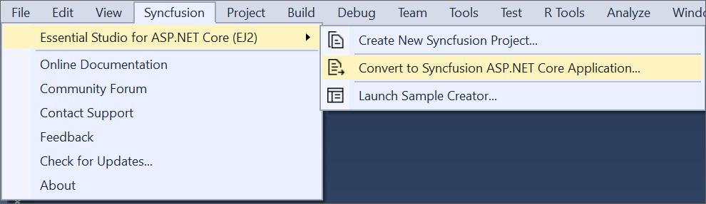
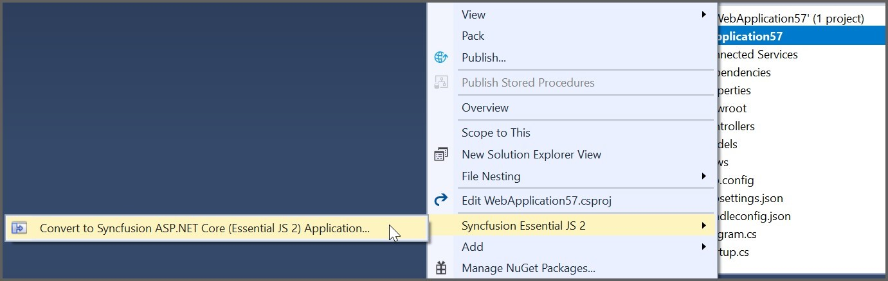
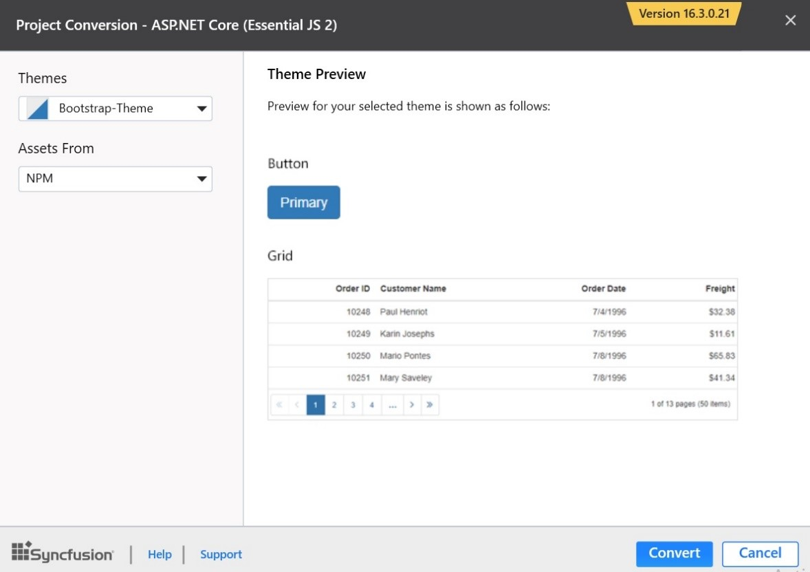

# Convert Project

Syncfusion project conversion is a Visual Studio add-in that converts an existing ASP.NET Core application into a Syncfusion ASP.NET Core (Essential JS 2) Web application by adding the required assemblies and resource files.

## IMPORTANT

The Syncfusion ASP.NET Core (Essential JS 2) Web Application Project conversion utility is available from v16.3.0.17.

The following steps helps you to use the Syncfusion Project conversion in the existing ASP.NET Core Web Application.

> Before use, the Syncfusion ASP.NET Core Project Conversion, check whether the **ASP.NET Core Extensions - Syncfusion** installed or not in Visual Studio Extension Manager by clicking on the Tools -> Extensions and Updates -> Installed for Visual Studio 2017 or lower and for Visual Studio 2019 by clicking on the Extensions -> Manage Extensions -> Installed. Also, check whether the corresponding Essential Studio version build installed or not. If the Essential Studio version is not same for both the Extension and build, then the Project Conversion will not be shown.

1. Open an existing Microsoft ASP.NET Core Web Application or create a new Microsoft ASP.NET Core Web Application.

2. Open the conversion dialog by either one of the options below:

    **Option 1:**

    Click **Syncfusion Menu** and choose **Essential Studio for ASP.NET Core (EJ2) > Convert to Syncfusion ASP.NET Core Application…** in **Visual Studio**.

    

    > In Visual Studio 2019, Syncfusion menu is available under Extension in Visual Studio menu.

    **Option 2:**

    Right-click the **Project** from Solution Explorer, select **Syncfusion Essential JS 2**, and choose the **Convert to Syncfusion ASP.NET Core (Essential JS 2) Application…** Refer to the following screenshot for more information.

    

3. Project Conversion Wizard opens to configure the project.

    

    The following configurations are used in the Project conversion wizard.

    **Assets From:**Load the Syncfusion Essential JS 2 assets to ASP.NET Core Project, either NuGet, CDN, or Installed Location.

   

   > Installed location option will be available only when the Syncfusion Essential JavaScript 2 setup has been installed.

   **Choose the Theme:** Choose the required theme. The Theme Preview section shows the controls preview before convert into a Syncfusion project.

   

4. The **Project Backup** dialog appears by clicking the **Convert** button. In the dialog, if you click **Yes**, it will backup the current project before converting into Syncfusion project. If you click **No**, it will convert the project to Syncfusion project without backup.

    

5. The required Syncfusion NuGet packages, Scripts and CSS are included in the ASP.NET Core Web Application. Refer to the following screenshots for more information.

    

    

    

6. If you installed the trial setup or NuGet packages from nuget.org you have to register the Syncfusion license key to your project since Syncfusion introduced the licensing system from 2018 Volume 2 (v16.2.0.41) Essential Studio release. Navigate to the [help topic](https://help.syncfusion.com/common/essential-studio/licensing/license-key#how-to-generate-syncfusion-license-key) to generate and register the Syncfusion license key to your project. Refer to this [blog](https://blog.syncfusion.com/post/Whats-New-in-2018-Volume-2-Licensing-Changes-in-the-1620x-Version-of-Essential-Studio.aspx?_ga=2.11237684.1233358434.1587355730-230058891.1567654773) post for understanding the licensing changes introduced in Essential Studio.