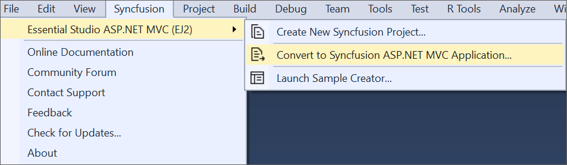
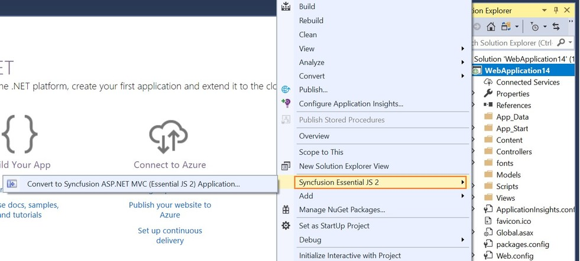
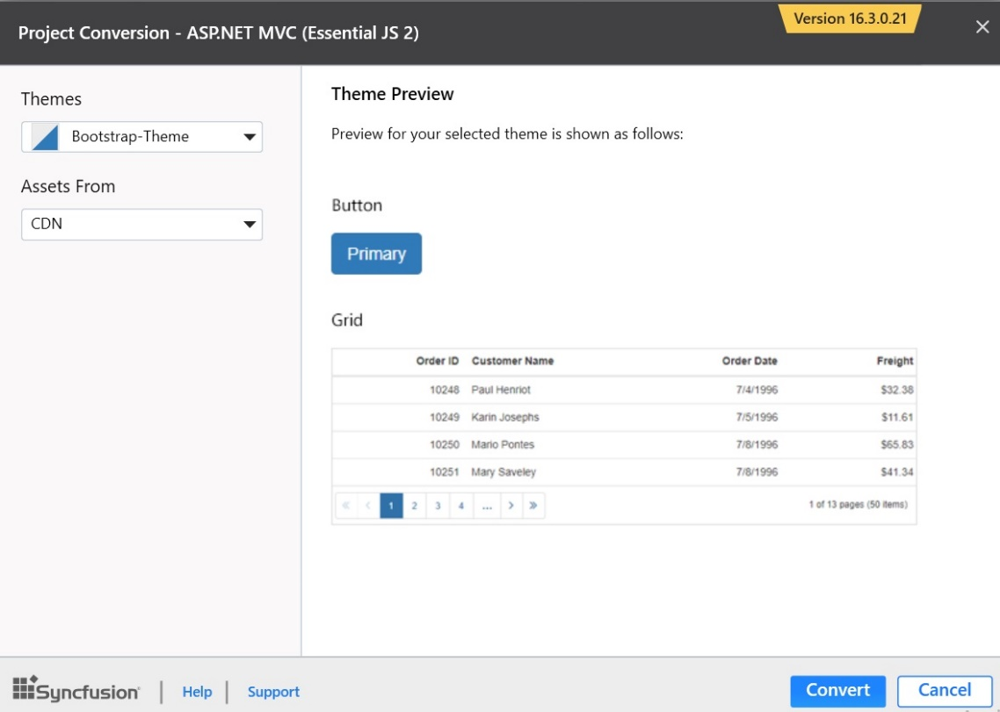

# Convert Project

Syncfusion project conversion is a Visual Studio add-in that converts an existing ASP.NET MVC application into the Syncfusion ASP.NET MVC (Essential JS 2) Web application by adding the required assemblies and resource files.

## IMPORTANT

The Syncfusion ASP.NET MVC (Essential JS 2) Web Application Project conversion utility is available from v16.3.0.17.

The following steps help you use the Syncfusion Project conversion in the existing ASP.NET MVC Web Application:

1. Open an existing Microsoft ASP.NET MVC Web Application or create a new Microsoft ASP.NET MVC Web Application.

2. Open the conversion dialog by either one of the options below:

    **Option 1:**

    Click **Syncfusion Menu** and choose **Essential Studio for ASP.NET MVC (EJ2) > Convert to Syncfusion ASP.NET MVC Application…** in **Visual Studio**.

    

    > In Visual Studio 2019, Syncfusion menu is available under Extension in Visual Studio menu.

    **Option 2:**

    Right-click the **Project** from Solution Explorer, select **Syncfusion Essential JS 2**, and choose the **Convert to Syncfusion ASP.NET MVC (Essential JS 2) Application…** Refer to the following screenshot for more information.

    

3. Project Conversion Wizard opens to configure the project.

    

    The following configurations are used in the Project conversion wizard.

    **Assets From**: Load the Syncfusion Essential JS 2 assets to ASP.NET MVC Project, either NuGet, CDN, or Installed Location.

    **Choose the Theme**: Choose the required theme. The Theme Preview section shows the controls preview before converting into a Syncfusion project.

4. The **Project Backup** dialog will appear when **Click** the **Convert** button. In the dialog, if click **Yes**, it will backup the current project before converting into Syncfusion project. If click **No**, it will convert the project to Syncfusion project without backup.

    

5. The required Syncfusion Reference Assemblies, Scripts, and CSS are included in the ASP.NET MVC Web Application. Refer to the following screenshots for more information.

    

    

    

6. If you installed the trial setup or NuGet packages from nuget.org you have to register the Syncfusion license key to your project since Syncfusion introduced the licensing system from 2018 Volume 2 (v16.2.0.41) Essential Studio release. Navigate to the [help topic](https://help.syncfusion.com/common/essential-studio/licensing/license-key#how-to-generate-syncfusion-license-key) to generate and register the Syncfusion license key to your project. Refer to this [blog](https://blog.syncfusion.com/post/Whats-New-in-2018-Volume-2-Licensing-Changes-in-the-1620x-Version-of-Essential-Studio.aspx?_ga=2.11237684.1233358434.1587355730-230058891.1567654773) post for understanding the licensing changes introduced in Essential Studio.