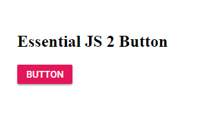

<!-- markdownlint-disable MD024 -->

# Getting Started with Syncfusion JavaScript (ES5) UI control in a quickstart application

This article provides a step-by-step introduction to configure Syncfusion JavaScript (ES5) UI control (Essential JS 2) and build a simple HTML web application.

## Getting started by using local script and style references

### Prerequisites

* [Essential Studio JavaScript (Essential JS 2)](https://www.syncfusion.com/downloads/essential-js2)
* [Visual Studio Code](https://code.visualstudio.com/)

### Setup development environment

1. Create an app folder `quickstart` for getting started.

2. The Syncfusion JavaScript (ES5) control needs it's dependent control resources. The Syncfusion JavaScript control dependencies are listed in the corresponding control's getting started documentation. For getting started the Button control is used in this application and refer to this [documentation](https://ej2.syncfusion.com/javascript/documentation/button/es5-getting-started.html) to learn about the button control dependencies.

    **Syntax:**
    > Dependency Script: `**(installed location)**\Syncfusion\Essential Studio\JavaScript - EJ2\{RELEASE_VERSION}\Web (Essential JS 2)\JavaScript\{DEPENDENCY_PACKAGE_NAME}\dist\global\{DEPENDENCY_PACKAGE_NAME}.min.js`
    >
    > Control Script: `**(installed location)**\Syncfusion\Essential Studio\JavaScript - EJ2\{RELEASE_VERSION}\Web (Essential JS 2)\JavaScript\{PACKAGE_NAME}\dist\global\{PACKAGE_NAME}.min.js`
    >
    > Dependency Styles: `**(installed location)**\Syncfusion\Essential Studio\JavaScript - EJ2\{RELEASE_VERSION}\Web (Essential JS 2)\JavaScript\{DEPENDENCY_PACKAGE_NAME}\styles\material.css`
    >
    > Control Styles: `**(installed location)**\Syncfusion\Essential Studio\JavaScript - EJ2\{RELEASE_VERSION}\Web (Essential JS 2)\JavaScript\{PACKAGE_NAME}\styles\material.css`

    **Example:**

    > Dependency Script: `C:\Program Files (x86)\Syncfusion\Essential Studio\JavaScript - EJ2\16.3.0.17\Web (Essential JS 2)\JavaScript\ej2-base\dist\global\ej2-base.min.js`
    >
    > Control Script: `C:\Program Files (x86)\Syncfusion\Essential Studio\JavaScript - EJ2\16.3.0.17\Web (Essential JS 2)\JavaScript\ej2-buttons\dist\global\ej2-buttons.min.js`
    >
    > Dependency Styles: `C:\Program Files (x86)\Syncfusion\Essential Studio\JavaScript - EJ2\16.3.0.17\Web (Essential JS 2)\JavaScript\ej2-base\styles\material.css`
    >
    > Control Styles: `C:\Program Files (x86)\Syncfusion\Essential Studio\JavaScript - EJ2\16.3.0.17\Web (Essential JS 2)\JavaScript\ej2-buttons\styles\material.css`

    The below located script and style file contains all Syncfusion JavaScript (ES5) UI control resources in a single file.

    > Scripts: `**(installed location)**\Syncfusion\Essential Studio\JavaScript - EJ2\{RELEASE_VERSION}\Web (Essential JS 2)\JavaScript\ej2\dist\ej2.min.js`
    >
    > Styles: `**(installed location)**\Syncfusion\Essential Studio\JavaScript - EJ2\{RELEASE_VERSION}\Web (Essential JS 2)\JavaScript\ej2\material.css`

    The [Custom Resource Generator (CRG)](https://crg.syncfusion.com/) is an online web tool, which can be used to generate the custom script and styles for a set of specific controls. This web tool is useful to combine the required control scripts and styles in a single file.

3. Create a folder `~/quickstart/resources` and copy/paste the global scripts and styles from the above installed location to `~/quickstart/resources/package` corresponding package location.

### Configure Syncfusion JavaScript (ES5) control in the application

1. Open the application in VS Code and create a HTML file `~/quickstart/index.html` and add the Syncfusion JavaScript (ES5) control's script and style references.

    ```html
    <!DOCTYPE html>
    <html xmlns="http://www.w3.org/1999/xhtml">
        <head>
            <title>Syncfusion JavaScript (ES5) UI Control</title>
            <!-- Essential JS 2 Base's material theme (Dependency Styles) -->
            <link href="resources/base/material.css" rel="stylesheet" type="text/css"/>

            <!-- Essential JS 2 Button's material theme (Control Styles) -->
            <link href="resources/button/material.css" rel="stylesheet" type="text/css"/>

            <!-- Essential JS 2 Base's global script (Dependency Script) -->
            <script src="resources/base/ej2-base.min.js" type="text/javascript"></script>

            <!-- Essential JS 2 Button's global script (Control Script) -->
            <script src="resources/button/ej2-buttons.min.js" type="text/javascript"></script>
        </head>
        <body>
            ....
            ....
        </body>
      </html>
      ```

2. Now, add the `Button` element and initiate the `Syncfusion JavaScript (ES5) Button` control in the `~/quickstart/index.html` by using below code.

    ```html
    <!DOCTYPE html>
    <html xmlns="http://www.w3.org/1999/xhtml">
        <head>
            ....
            ....
        </head>
        <body>
            <h2>Essential JS 2 Button</h2>
            <!-- Add HTML button element -->
            <button id="btn">Button</button>

            <script>
                // Initialize Essential JS 2 JavaScript Button control
                var button = new ej.buttons.Button({ isPrimary: true });
                button.appendTo('#btn');
            </script>
        </body>
    </html>
    ```

3. Finally, run the `~/quickstart/index.html` file in the web browser and it will render the Syncfusion JavaScript Button control.

    

## Getting started by using CDN link for script and style references

### Prerequisites

* [Visual Studio Code](https://code.visualstudio.com/)

### Configure Syncfusion JavaScript (ES5) control in the application

1. Create an app folder `quickstart` for the Syncfusion JavaScript (ES5) controls and open it in the Visual Studio Code.

2. The Syncfusion JavaScript control needs it's dependent control resources. The Syncfusion JavaScript control dependencies are listed in the corresponding control's getting started documentation. For getting started the Button control is used in this application and refer to this [documentation](https://ej2.syncfusion.com/javascript/documentation/button/es5-getting-started.html) to learn about the button control dependencies.

    **Syntax:**
    > Dependency Script: `https://cdn.syncfusion.com/ej2/{DEPENDENCY_PACKAGE_NAME}/dist/global/{DEPENDENCY_PACKAGE_NAME}.min.js`
    > Contorl Script: `https://cdn.syncfusion.com/ej2/{PACKAGE_NAME}/dist/global/{PACKAGE_NAME}.min.js`
    >
    > Dependency Styles: `https://cdn.syncfusion.com/ej2/{DEPENDENCY_PACKAGE_NAME}/styles/material.css`
    > Control Styles: `https://cdn.syncfusion.com/ej2/{PACKAGE_NAME}/styles/material.css`

    **Example:**
    > Dependency Script: [`https://cdn.syncfusion.com/ej2/ej2-base/dist/global/ej2-base.min.js`](https://cdn.syncfusion.com/ej2/ej2-base/dist/global/ej2-base.min.js)
    > Control Script: [`https://cdn.syncfusion.com/ej2/ej2-buttons/dist/global/ej2-buttons.min.js`](https://cdn.syncfusion.com/ej2/ej2-buttons/dist/global/ej2-buttons.min.js)
    >
    > Dependency Styles: [`https://cdn.syncfusion.com/ej2/ej2-base/styles/material.css`](https://cdn.syncfusion.com/ej2/ej2-base/styles/material.css)
    > Control Styles: [`https://cdn.syncfusion.com/ej2/ej2-buttons/styles/material.css`](https://cdn.syncfusion.com/ej2/ej2-buttons/styles/material.css)

    The below hosted CDN links contains all Syncfusion JavaScript (ES) control resources in a single file.

    > Scripts: `https://cdn.syncfusion.com/ej2/dist/ej2.min.js`
    >
    > Styles: `https://cdn.syncfusion.com/ej2/material.css`

3. Create a HTML file `~/quickstart/index.html` and add the below CDN link references. Now, add the `Button` element and initiate the `Syncfusion JavaScript Button` control in the index.html by using following code.

    

    ```html
    <!DOCTYPE html>
    <html xmlns="http://www.w3.org/1999/xhtml">
        <head>
            <title>Syncfusion JavaScript (ES5) UI Control</title>
            <!-- Essential JS 2 Base's material theme (Dependency Styles) -->
            <link href="https://cdn.syncfusion.com/ej2/ej2-base/styles/material.css" rel="stylesheet" type="text/css"/>

            <!-- Essential JS 2 Button's material theme (Control Styles) -->
            <link href="https://cdn.syncfusion.com/ej2/ej2-buttons/styles/material.css" rel="stylesheet" type="text/css"/>

            <!-- Essential JS 2 Base's global script (Dependency Script) -->
            <script src="https://cdn.syncfusion.com/ej2/ej2-base/dist/global/ej2-base.min.js" type="text/javascript"></script>

            <!-- Essential JS 2 Button's global script (Control Script) -->
            <script src="https://cdn.syncfusion.com/ej2/ej2-buttons/dist/global/ej2-buttons.min.js" type="text/javascript"></script>
        </head>
        <body>
            <h2>Syncfusion JavaScript (ES5) Button Control</h2>
            <!-- Add HTML button element -->
            <button id="btn">Button</button>

            <script>
                ej.base.enableRipple(true);

                // Initialize Essential JS 2 JavaScript Button control
                var button = new ej.buttons.Button({ isPrimary: true });
                button.appendTo('#btn');
            </script>
        </body>
      </html>
      ```

      

4. Finally, run the `~/quickstart/index.html` file in the web browser and it will render the Syncfusion JavaScript Button control.