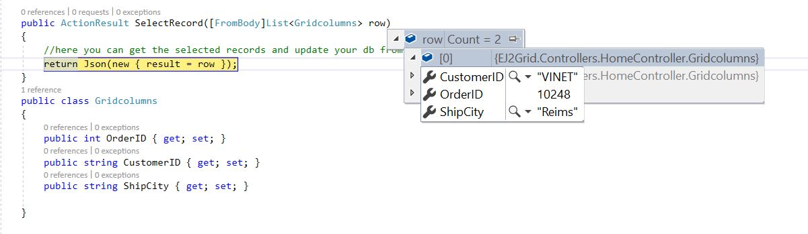

# Passing the selected records to the server using ajax request via custom toolbar button click"

You can pass the selected records to the server with the help of an ajax request. In the `toolbarClick` event, you can get the selected records using the [`getSelectedRecords`](../api/grid/#getselectedrecords) method and pass the selected records to the server using the **data** property of the ajax.

```typescript
import { Grid, Page,Toolbar } from '@syncfusion/ej2-grids';
import { Ajax } from '@syncfusion/ej2-base';

Grid.Inject(Page,Toolbar);
let grid: Grid = new Grid({
    dataSource: data,
    allowSelection: true,
    toolbar: ['Selected'],
    columns: [
        { type: 'checkbox', width: 50, },
        { field: 'OrderID', headerText: 'Order ID', textAlign: 'Right', width: 120},
        { field: 'CustomerID', width: 140, headerText: 'CustomerID'},
        { field: 'ShipCity', headerText: 'Ship Country', width: 140 }
    ],
    toolbarClick: function (args) {
        if (args.item.text === 'Selected') {
            var selectedRecord = this.getSelectedRecords();
            var ajax = new Ajax({
                url: "/Home/SelectRecord",
                type: "POST",
                contentType: "application/json",
                data: JSON.stringify(selectedRecord),
                successHandler: function (response) {
                    console.log(JSON.parse(response));
                },
                failure: function (response) {
                    alert(response);
                }
            });
            ajax.send();
        }
    },
});
grid.appendTo('#Grid');
```

The selected record details are bound to the `row` parameter. Please refer to the following screenshot.

