# Implementation and working flow of annotation toolbar

## To Open the Annotation Toolbar

**Step 1:** To enable the annotation toolbar, click the editAnnotation toolbar.

**Step 2:** After enabling the annotation toolbar.

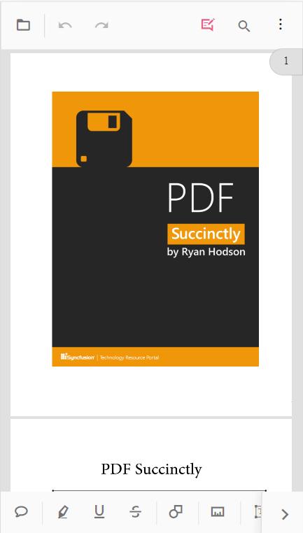

## To add sticky notes annotation

**Step 1:** click sticky notes icon and then click in the page where you want to add this.

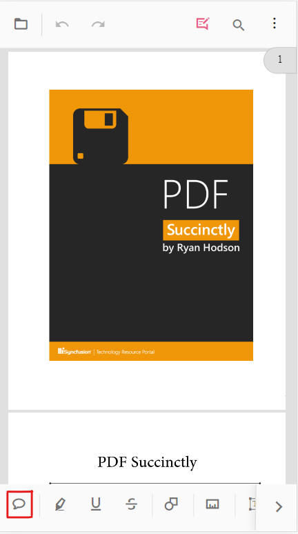

**Step 2:** Click in the page to add the sticky notes annotation.

## To add text markup annotation

**Step 1:** click any one of the text markup icon, then select the text you want to mark, then touch the selected text to apply the markup annotation.

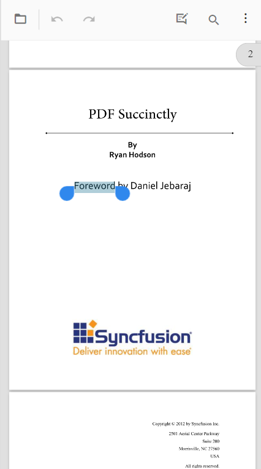

**Step 2:** Add the text markup annotation in the PDF page

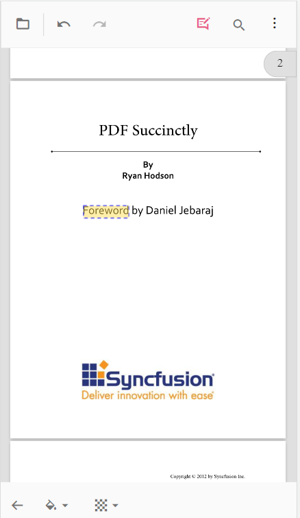

## To add shape and measure annotations

**Step 1:** click the shape/measure icon in the toolbar. It will show the toolbar with shape/measure types.

**Step 2:** Click the shape/measure type and add annotation to the page.

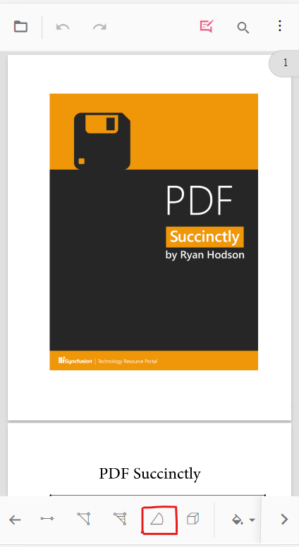

**Step 3:** Add the annotation in the PDF page.

## To add the stamp annotation

**Step 1:** click the stamp icon and select the stamp type from the menu items.

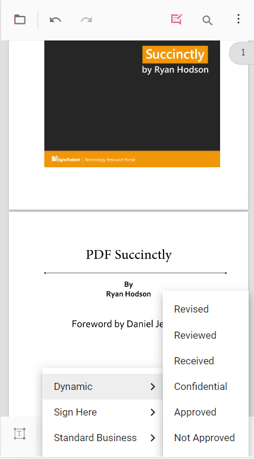

**Step 2:** Add the stamp annotation in the page.

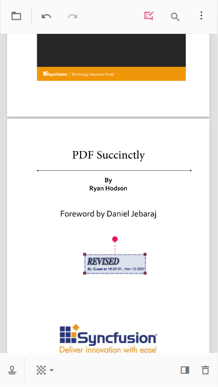

## To add signature

**Step 1:** click the signature icon. This will open the signature canvas to draw signature. After drawn the sign, should click the create button and touch the viewer to add the signature.

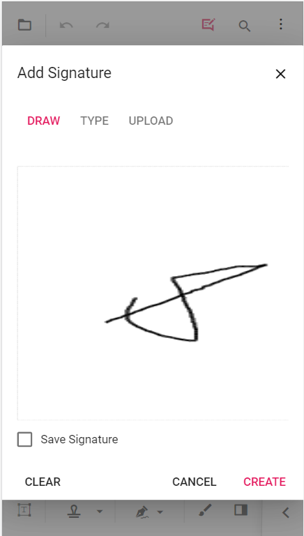

**Step 2:** Add the signature in the page.

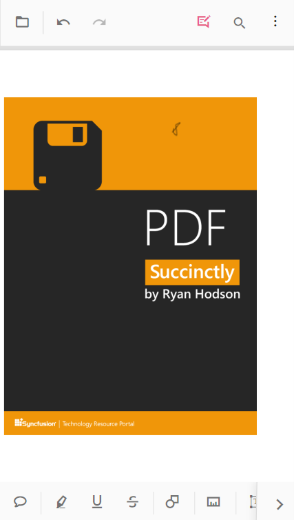

## To add ink annotation

**Step 1:** Click the ink icon tool and draw in the page.

**Step 2:** Add the ink annotation in the page.

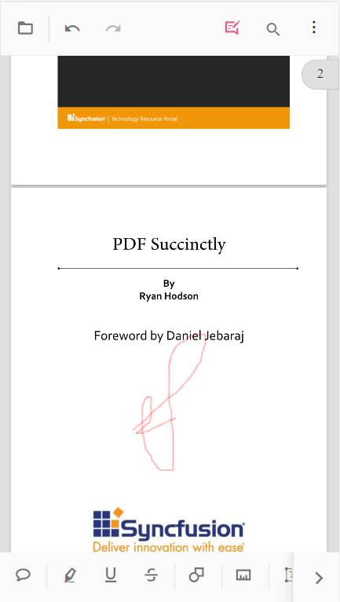

## Change Annotation Change (Before adding)

**Step 1:** We can change the properties before adding the annotation.

**Step 2:** Click the annotation icon, this will show the toolbar with corresponding properties. We can change the property and add the annotation in the page.

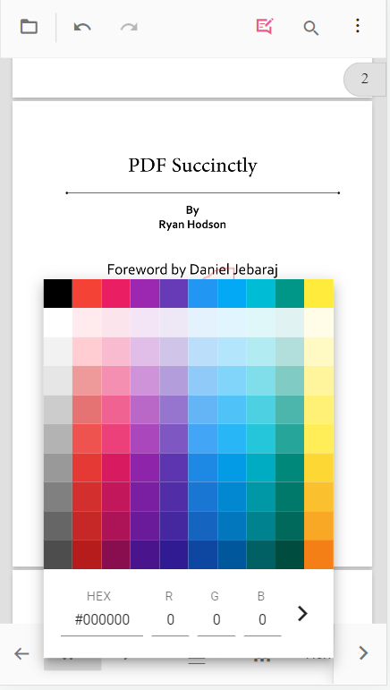

## Change Annotation Property (After Adding)

**Step 1:** We can change the annotation property after adding the annotation.

**Step 2:** Select the added annotation, it will show the corresponding property tool. This will help us to change the property of the annotation.

## Delete Annotation

**Step 1:** To delete the annotation, first select the annotation, it will show the property toolbar. In the property tool there is an icon to delete the annotation.

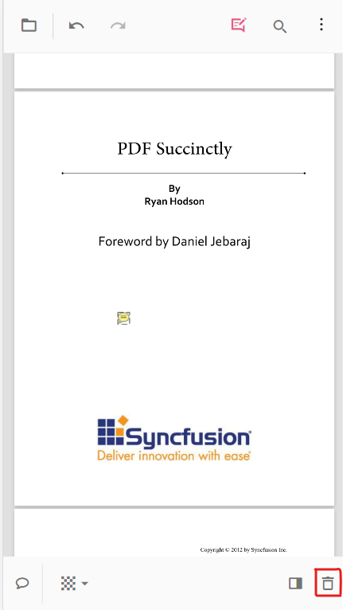

## Open Comment Panel

**Step 1:** We can open the comment panel through the icon in the property tool or through the annotation toolbar.

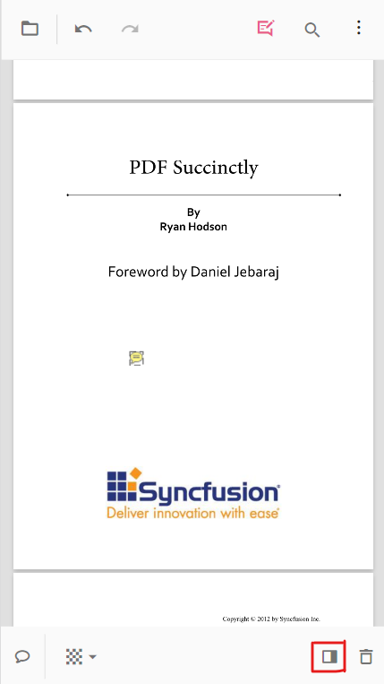

**Step 1:** After opening the comment panel

## Close the comment panel

**Step 1:** To close the comment panel, click the close button.

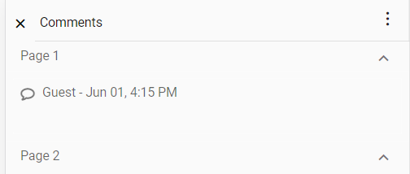