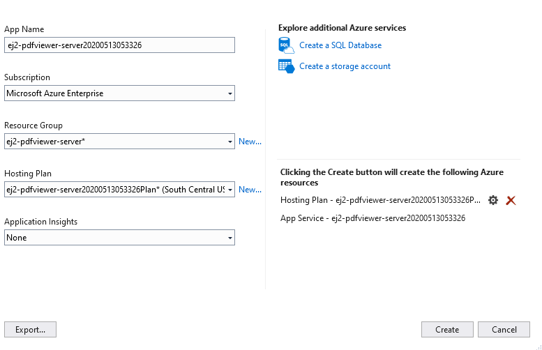

# How to Publish a PDF Viewer Web API Application in Azure App Service from Visual Studio

## Prerequisites

* Visual Studio 2017 or Visual Studio 2019.
* An [`Azure subscription`](https://azure.microsoft.com/en-gb/).
* Create the [`PDF Viewer Web API application`](https://www.syncfusion.com/kb/10346/how-to-create-pdf-viewer-web-service-application-in-asp-net-core).
* Make sure you’ve built the project using the Build > Build Solution menu command before following the deployment steps.

## Publish to Azure App Service

**Step 1:** In Solution Explorer, right-click the project and choose Publish (or use the Build > Publish menu item).

 

**Step 2:** If you have previously configured any publishing profiles, the Publish pane appears, in which case, select Create new profile.

**Step 3:** In the Pick a publish target dialog box, choose App Service.

**Step 4:** Select Publish. The Create App Service dialog box appears. Sign in with your Azure account, if necessary, then the default app service settings populate the fields.

**Step 5:** Select Create. Visual Studio deploys the app to your Azure App Service, and the web app loads in your browser at `http://<app_name>.azurewebsites.net`. (i.e. `http:// ej2-pdfviewer-server20200513053326.azurewebsites.net`).

**Step 6:** Navigate to the PDF Viewer Web API control `http://ej2-pdfviewer-server20200513053326.azurewebsites.net/api/pdfviewer`. It returns the default get method response.

Append the app service running the URL `http://ej2-pdfviewer-server20200513053326.azurewebsites.net./api/pdfviewer` to the service URL in the client-side PDF Viewer control. For more information about how to get started with the PDF Viewer control, refer to this [`getting started page`](https://ej2.syncfusion.com/javascript/documentation/pdfviewer/getting-started/?).

For more information about the app container service, please look deeper into the [`Microsoft Azure App Service`](https://docs.microsoft.com/en-us/visualstudio/deployment/) for a production-ready setup.