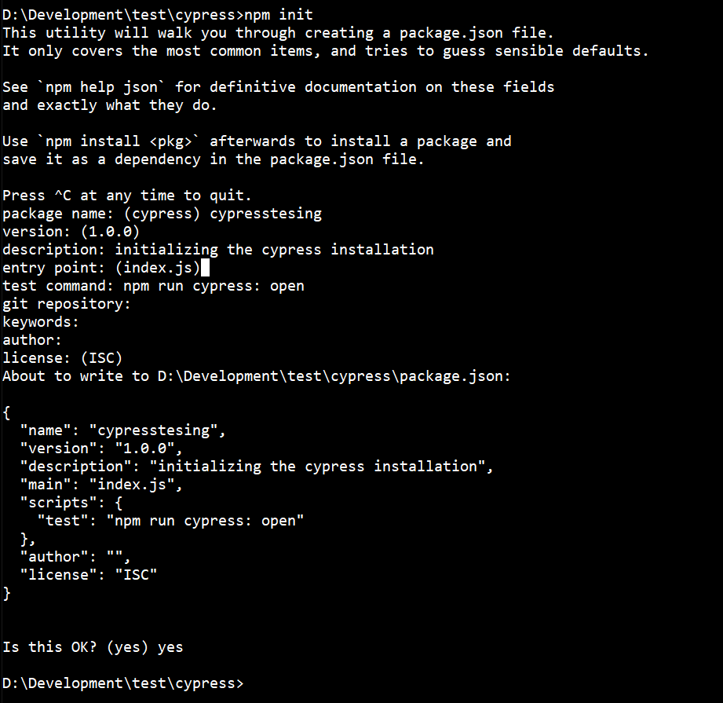
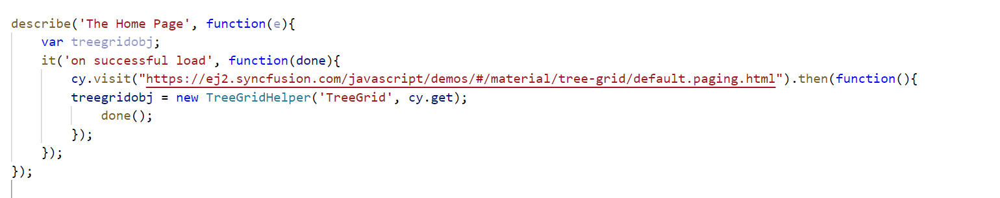
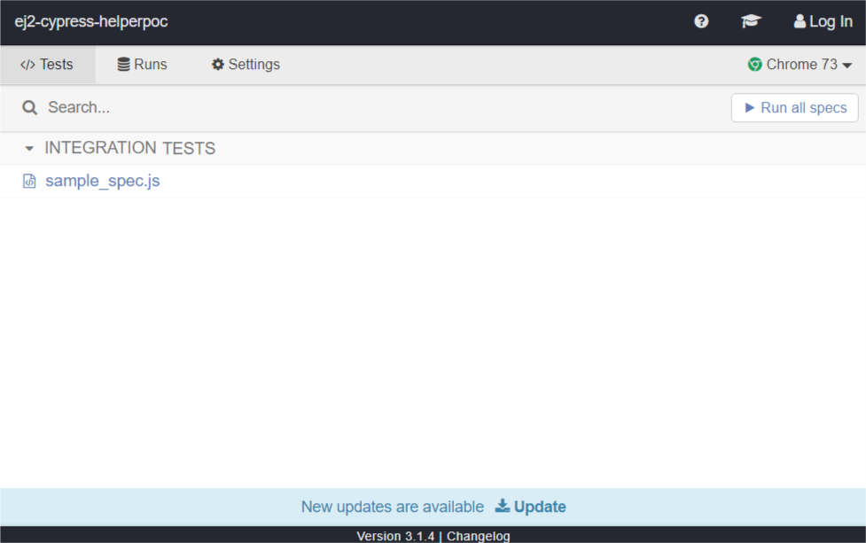
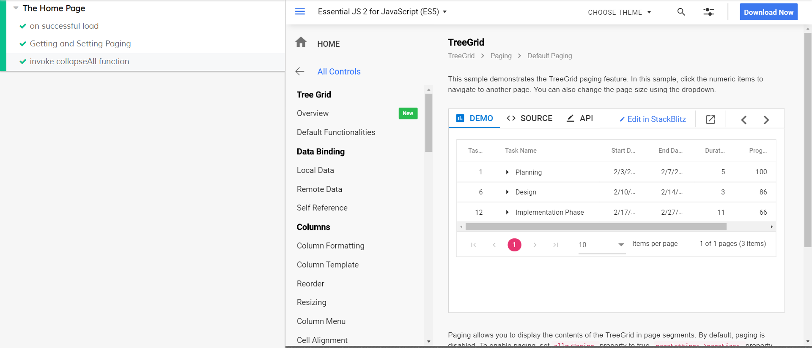

# Getting started with Cypress

This section describes how to create a Cypress project and test the Tree Grid component using the Tree Grid Test Helper.

## Setting up the Cypress Project

To set the cypress project, follow these steps to create a project:
* Open the command prompt and set up the root project directory.
* Run the **npm init** command.



* Install Cypress to the project. Refer to the Cypress [installation link](https://docs.cypress.io/guides/getting-started/installing-cypress.html#Installing) to install.

* Start writing [your testcase](https://docs.cypress.io/guides/getting-started/writing-your-first-test.html#Add-a-test-file).

## Installing syncfusion package

The test helpers are available in the Syncfusion default component packages. Here, Tree Grid component is tested. So, run the following command to install the Syncfusion Tree Grid component.

> npm install @syncfusion/ej2-treegrid --save

## Importing Test Helper from the package

You can test the drop-down components by using the `TreeGridHelper` class that is imported from the `@syncfusion/ej2-treegrid` package. The helper class is available in the `helpers/e2e` folder in every Syncfusion components package.

* Create a `sample_spec.js` file in the `cypress/integration/` folder.
* Import the testinghelper class name which is to be tested in the created file.

*Syntax:*

```typescript
import { TestHelperClassName } from '{ helperPath }'
```

*For example,*

```typescript
import { TreeGridHelper } from '@syncfusion/ej2-treegrid/helpers/e2e'
```

## Initializing the test helper

After importing the testing helper,follow these steps:

* Set the website page URL or local sample path that you want to test in browser. Here, the demo site is used for example.

```typescript
cy.visit('https://ej2.syncfusion.com/demos/tree-grid/default-paging/index.html')
```

* Initialize the helpers as follows.

```typescript
var curTreeGrid = new TreeGridHelper('TreeGrid', cy.get)
```

Refer to the following screenshot for detailed helper class initiation.



## Write test case using helper methods

After initializing the helpers, you can write the test cases. Following are some of the simple examples for helper functions with test cases.

### Using getModel setModel

After the visiting page is loaded, write the test case to get and set the values.

*For example,*

If you need to set the element’s value, then you can use this `setModel` helper function.
Similarly, the element’s value is tested by the `getModel` helper function.

```typescript
 it('getting setting model', function () {
    curTreeGrid.setModel("allowPaging", false);
    curTreeGrid.getModel("allowPaging").should('eq', false);
  });
  ```

### Using Invoke function

 If you want to invoke some functions, you can use the `invoke` helper function.

```typescript
it('invoke function', function () {
    curTreeGrid.invoke("collapseAll");
  });
```

Here, the `collapseAll` method is used to collapse all the parent records in the Tree Grid component.

## Running Cypress

To run the Cypress, follow these steps:

* Run the npm run cypress:open terminal command from the root directory to open the Cypress test runner application. The Cypress application will open as follows.



* Now, the `sample_spec.js` file will show in the Cypress application window. Click that file to get the output window as follows.



> **Note:** Refer to the GitHub samples for quick implementation and testing from [here](https://github.com/SyncfusionExamples/ej2-cypress-helperpoc).